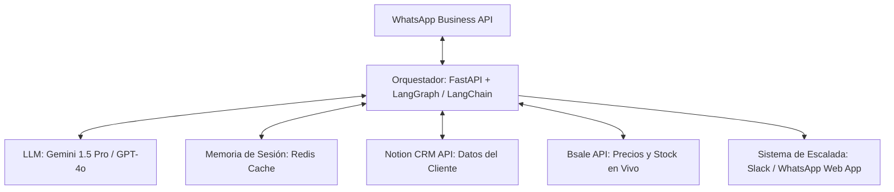
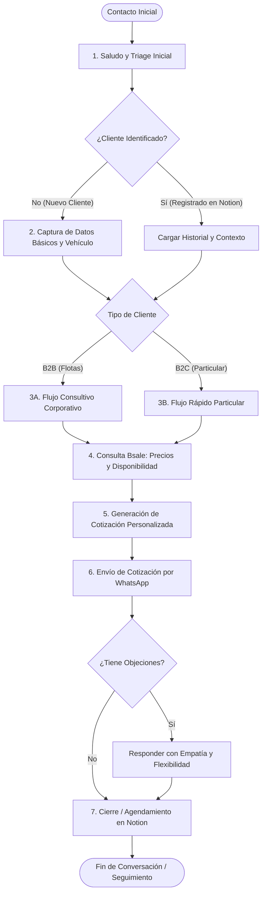
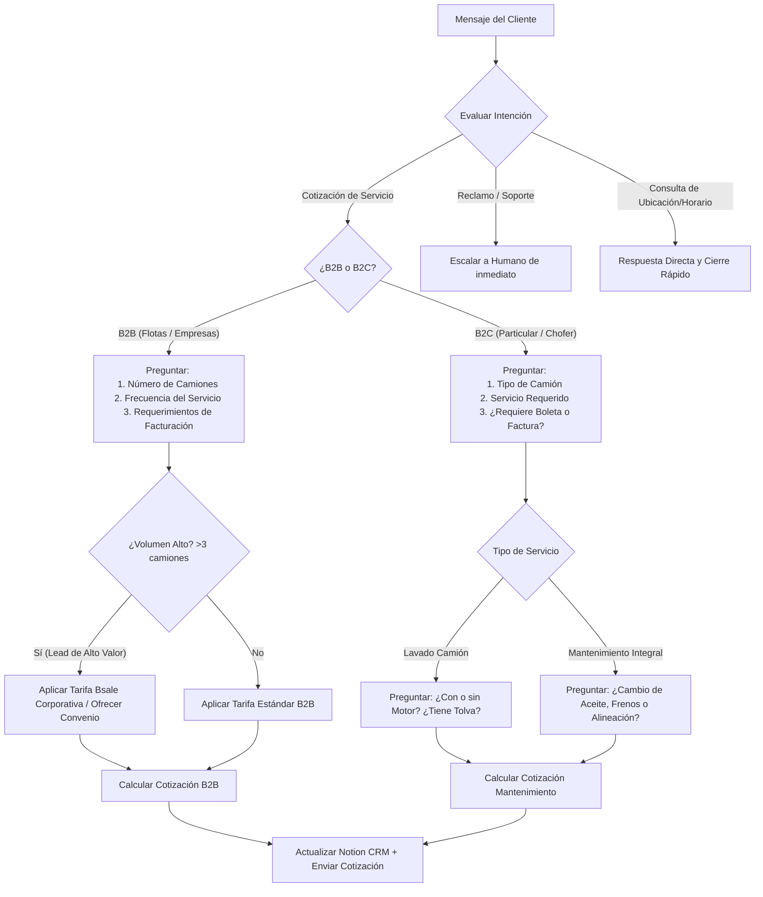
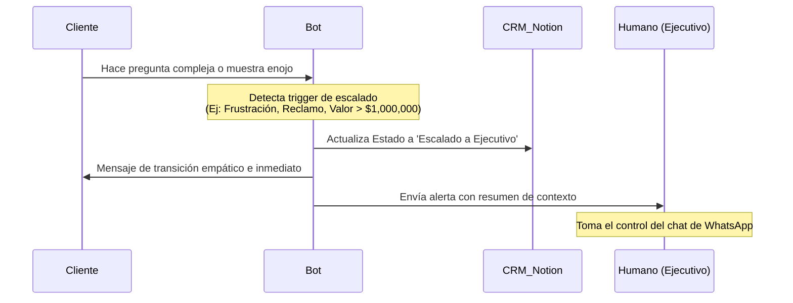

# Arquitectura de Agente de IA para TruckCenter: Sistema Consultivo de Ventas B2B/B2C

Este documento detalla la arquitectura de software, el diseño conversacional, los flujos de decisión y el mapeo de integraciones para el agente de inteligencia artificial de **TruckCenter** diseñado para operar en WhatsApp Business. El objetivo principal es ofrecer un servicio de atención y venta consultiva 24/7, humanizado, eficiente y conectado en tiempo real con **Notion CRM** y **Bsale**.

---

## 1. Arquitectura General del Sistema

El agente de IA se basa en un diseño modular que separa la interfaz conversacional, el motor de razonamiento (orquestador), la memoria y las integraciones externas.



### Stack Tecnológico Recomendado
*   **Orquestador de Agentes:** `LangGraph` (para manejar el flujo de decisiones estructurado y no lineal a través de grafos de estado).
*   **API Framework:** `FastAPI` (Python) para recibir webhooks de WhatsApp y exponer servicios.
*   **Memoria de Corto Plazo:** `Redis` (para guardar el estado de la sesión, variables temporales y el historial de chat de las últimas 24 horas).
*   **Base de Conocimientos / CRM:** `Notion CRM API` (para persistencia de perfiles de clientes y estados de negociación).
*   **ERP / Inventario / Precios:** `Bsale API` (para consulta de stock y facturación en tiempo real).
*   **Proveedor de API de WhatsApp:** `Twilio` o `Meta Cloud API` directo.

---

## 2. Flujo de Decisiones Principal

El flujo de decisiones guía al cliente desde el saludo inicial hasta la entrega de la cotización y el agendamiento del servicio. El agente recopila datos de manera natural durante el diálogo.



### Fases Detalladas del Flujo
1.  **Saludo y Triage Inicial:** El bot responde al mensaje inicial en menos de 10 segundos. Identifica el número de WhatsApp y consulta en Notion CRM si el número ya existe.
2.  **Captura de Datos Básicos y Vehículo:** Si es nuevo, el bot pregunta de manera amigable por su nombre y qué vehículo maneja (modelo de camión, si tiene acoplado, etc.). Esta información es crucial porque las tarifas de lavado y mantenimiento técnico varían según las dimensiones del camión.
3.  **Triage de Tipo de Cliente:** El bot califica si es un transportista particular (B2C) o un gestor de flota/empresa de transportes (B2B).
4.  **Consulta a Bsale:** El bot interactúa con Bsale para obtener el precio base actualizado y confirmar la disponibilidad de insumos o el espacio en el taller.
5.  **Generación y Envío de Cotización:** Se formatea la cotización en un mensaje estructurado, visualmente limpio, y se envía.
6.  **Cierre / Agendamiento:** Si el cliente acepta, se actualiza el estado en Notion CRM a "Cotizado - Interesado" y se le ayuda a agendar el servicio.

---

## 3. Árbol de Razonamiento (Bifurcaciones)

El agente utiliza lógica condicional basada en el tipo de respuesta del usuario para bifurcar la conversación.



### Explicación de los Caminos Críticos:
*   **Bifurcación B2B vs B2C:**
    *   *Si es B2B:* El bot adopta un tono de consultor de operaciones. Entiende que para las flotas el tiempo de inactividad es dinero perdido. Ofrece opciones de convenios mensuales y prioridad en turnos.
    *   *Si es B2C:* El bot es más directo, se enfoca en la conveniencia inmediata, la calidad del lavado/servicio y la rapidez del proceso.
*   **Bifurcación por Tipo de Lavado/Servicio:**
    *   *Lavado:* El bot debe verificar si es lavado exterior simple, lavado de chasis, lavado de motor, o limpieza de tolva. Cada uno tiene un código de producto diferente en Bsale.
    *   *Mantenimiento:* Identifica kilometraje y síntoma para cotizar el paquete de mantenimiento correcto.

---

## 4. Mapeo de Integraciones

### A. Integración con Notion CRM
El agente debe leer e inyectar datos en una base de datos de Notion denominada `Clientes y Leads`.

#### Mapeo de Campos en Notion CRM:

| Campo en Notion | Tipo en Notion | Origen del Dato (Conversación en WhatsApp) | Ejemplo de Extracción |
| :--- | :--- | :--- | :--- |
| `Nombre Completo` | Título (Title) | Nombre proporcionado por el usuario | "Me llamo Roberto González" |
| `WhatsApp ID` | Texto (Rich Text) | ID del remitente de WhatsApp | `+56912345678` |
| `Empresa` | Texto (Rich Text) | Nombre de la empresa si es B2B | "Transportes del Norte S.A." |
| `Tipo de Cliente` | Select | Clasificación (Particular / Empresa) | Identificado en flujo |
| `Tamaño de Flota` | Número (Number) | Número de camiones declarados | "Tenemos 12 camiones activos" |
| `Tipo de Vehículo` | Select | Tipo de camión (Sencillo, Semirremolque, Tolva) | "Es un Scania R500 con tolva" |
| `Servicio Cotizado`| Multi-select | Servicios de interés del cliente | "Lavado completo y lavado de motor" |
| `Última Interacción`| Fecha (Date) | Timestamp actual del mensaje | `2026-07-12T01:40:00Z` |
| `Estado Lead` | Status | Progreso del embudo | `Cotizado - Interesado` |
| `Monto Cotizado` | Número (Number) | Suma de precios obtenidos de Bsale | `185000` (CLP) |

*Ejemplo de payload para actualizar Notion CRM:*
```json
{
  "properties": {
    "Nombre Completo": { "title": [{ "text": { "content": "Roberto González" } }] },
    "WhatsApp ID": { "rich_text": [{ "text": { "content": "+56912345678" } }] },
    "Empresa": { "rich_text": [{ "text": { "content": "Transportes del Norte S.A." } }] },
    "Tipo de Cliente": { "select": { "name": "Empresa" } },
    "Tamaño de Flota": { "number": 12 },
    "Tipo de Vehículo": { "select": { "name": "Semirremolque" } },
    "Servicio Cotizado": { "multi_select": [{ "name": "Lavado Completo" }, { "name": "Lavado de Chasis" }] },
    "Estado Lead": { "status": { "name": "Cotizado" } },
    "Monto Cotizado": { "number": 145000 }
  }
}
```

---

### B. Integración con Bsale API
Para cotizar de forma precisa, el bot realiza peticiones HTTP a la API de Bsale.

#### 1. Obtener precio y disponibilidad del servicio:
*   **Endpoint:** `GET https://api.bsale.cl/v1/products.json?name=[Nombre_Servicio]` o `GET https://api.bsale.cl/v1/variants.json?code=[Codigo_SKU]`
*   **Parámetros:** Nombre o SKU del servicio de lavado/mantenimiento específico según el tipo de vehículo.
*   **Respuesta de Bsale:**
```json
{
  "href": "https://api.bsale.cl/v1/variants/12345.json",
  "id": 12345,
  "description": "Servicio de Lavado Completo Camión Semirremolque",
  "code": "LAV-SEMI-01",
  "price": 120000.0,
  "taxValue": 22800.0,
  "totalPrice": 142800.0,
  "stock": 1,
  "state": 0
}
```

#### 2. Lógica de Negocio del Agente:
1.  Si el cliente indica que tiene un *camión sencillo*, el bot busca el SKU `LAV-SENC-01`.
2.  Si indica *semirremolque*, busca `LAV-SEMI-01`.
3.  Si es un cliente corporativo (B2B con más de 3 camiones), el bot aplica un descuento pre-aprobado (ej. 15% sobre el precio de Bsale) y lo presenta como un beneficio comercial exclusivo.

---

## 5. Patrones de Humanización y Habilidades Blandas

El bot debe sonar como un asesor comercial con experiencia, empático y resolutivo. Se aplican las siguientes directrices de escritura:

### A. Principios de Redacción
*   **Evitar estructuras de menú rígidas:** Nunca usar frases como: *"Escriba 1 para Lavado, 2 para Mecánica"*. En su lugar, usar: *"¿Qué andas buscando hoy? Cuéntame si necesitas un lavado rápido, un lavado completo de chasis o quizás una mantención para tus camiones."*
*   **Marcadores de Empatía (Soft Skills):** Si el cliente menciona que tiene prisa o que su camión está parado, el bot debe validar su situación:
    > "Uff, entiendo perfectamente. En el transporte cada hora con el camión parado es un dolor de cabeza. Déjame agilizar la cotización para que programemos esto lo antes posible."
*   **Uso del Nombre:** Incorporar el nombre del cliente de manera natural (máximo 2 veces por bloque de mensajes).

### B. Matriz de Respuestas (Humanizado vs. Bot)

| Situación Conversacional | Respuesta de Bot Tradicional (Evitar ❌) | Respuesta Humanizada TruckCenter (Usar ✅) |
| :--- | :--- | :--- |
| **Saludo Inicial** | "Hola, soy el asistente virtual de TruckCenter. Elija una opción." | "¡Hola! Qué gusto saludarte. Soy el asistente comercial de TruckCenter. 🚛 ¿Con quién tengo el gusto de hablar y en qué te puedo ayudar hoy con tus equipos?" |
| **Espera de API** | "Cargando precios de Bsale. Espere por favor..." | "Dame solo un segundito, Roberto. Estoy revisando aquí en el sistema los valores actuales y la disponibilidad de agenda para lavado de chasis... Listo, aquí lo tengo." |
| **Manejo de Objeción por Precio** | "El precio es fijo. No hay descuentos disponibles." | "Entiendo que el presupuesto es clave, sobre todo si manejas varios camiones. El valor que te di es el estándar por el nivel de detalle y los productos de protección que usamos, pero si agendas hoy mismo o si es para más de 3 camiones, puedo aplicar un descuento especial de flota. ¿Qué te parece?" |

### C. Reglas para el uso de Emojis y Formatos
*   **Emojis permitidos:** Usar solo emojis relacionados al rubro: 🚛, 🧼, 🛠️, 📅, 👍, Centralizar el uso a un máximo de 1 o 2 emojis por mensaje.
*   **Formato de texto:** Utilizar **negrita** para destacar valores monetarios, fechas o nombres de servicios. Esto facilita la lectura rápida en pantallas móviles.

---

## 6. Memoria y Gestión de Contexto

Para que la conversación sea fluida y no redundante, el agente cuenta con dos niveles de memoria:

### A. Memoria a Corto Plazo (Sesión Activa - 24 horas)
Almacenada en Redis. Guarda variables clave de la conversación para evitar repeticiones:
*   `nombre_cliente`: Roberto
*   `tipo_vehiculo`: Camión Scania Tolva
*   `servicios_solicitados`: `["Lavado Chasis", "Lavado Motor"]`
*   `intencion_actual`: `esperando_confirmacion_cotizacion`

Si el usuario desvía la conversación (ej. *"¿Y atienden los sábados?"*), el bot responde la duda y retoma el flujo original usando las variables en Redis: *"Sí Roberto, abrimos los sábados de 8:00 a 14:00 hrs. Volviendo a la cotización de los dos Scania con tolva, ¿te acomoda esa hora para agendar?"*

### B. Memoria a Largo Plazo (Historial en Notion CRM)
Cuando entra un mensaje, el orquestador busca el número de WhatsApp en la base de datos de Notion.
*   Si existe un registro previo con estado `Cliente Activo` o `Lead Perdido`, el bot carga las variables históricas.
*   *Personalización al retornar:* Si el cliente lavó su camión hace 15 días, el bot inicia la conversación reconociéndolo: *"¡Hola de nuevo, Roberto! Qué bueno tenerte de vuelta por TruckCenter. ¿Cómo quedó el Scania del lavado anterior? ¿Necesitas lavado de nuevo o andas buscando alguna mantención esta vez?"*

---

## 7. Protocolo de Escalada a Humanos

El agente no debe intentar resolver consultas para las cuales no está entrenado. Un traspaso a tiempo genera más confianza que un bot atascado.



### Disparadores para Escalado Inmediato:
1.  **Detección de Sentimiento Negativo / Enojo:** Palabras clave como *"estafa"*, *"mal servicio"*, *"quiero hablar con un humano"*, *"reclamo"*.
2.  **Solicitud Explícita de Humano:** Si el usuario pide hablar con una persona de soporte o ventas.
3.  **Preguntas Técnicas Complejas:** Dudas de reparaciones mecánicas complejas de motor (ej: *"¿Tienen repuestos para la transmisión de un Volvo FH16 2020?"*).
4.  **Clientes de Alto Valor (Flotas Grandes):** Si un cliente indica tener una flota de más de 10 camiones, el bot debe catalogarlo como "Lead VIP" y pasarlo a un ejecutivo humano en tiempo real después de tomar los datos básicos.

### Mensaje de Transición (Humanizado):
> "Roberto, para darte la respuesta exacta sobre esa reparación de motor y no cometer errores, prefiero comunicarte directamente con don Carlos, nuestro jefe de taller. Él es el experto en transmisiones Volvo. Ya le pasé todo nuestro chat para que esté al tanto. Te escribirá por este mismo chat en un par de minutos. ¡Que tengas un excelente día!"

### Datos que Recibe el Ejecutivo Humano en su Panel:
*   **Nombre del Cliente:** Roberto González
*   **Empresa / Flota:** Transportes del Norte S.A. (12 camiones)
*   **Motivo de Escalado:** Duda técnica sobre repuestos de transmisión Volvo FH16.
*   **Resumen Conversacional:** El cliente cotizó lavado completo para 3 camiones ($428,400 CLP), pero además requiere mantención de transmisión para una unidad.
